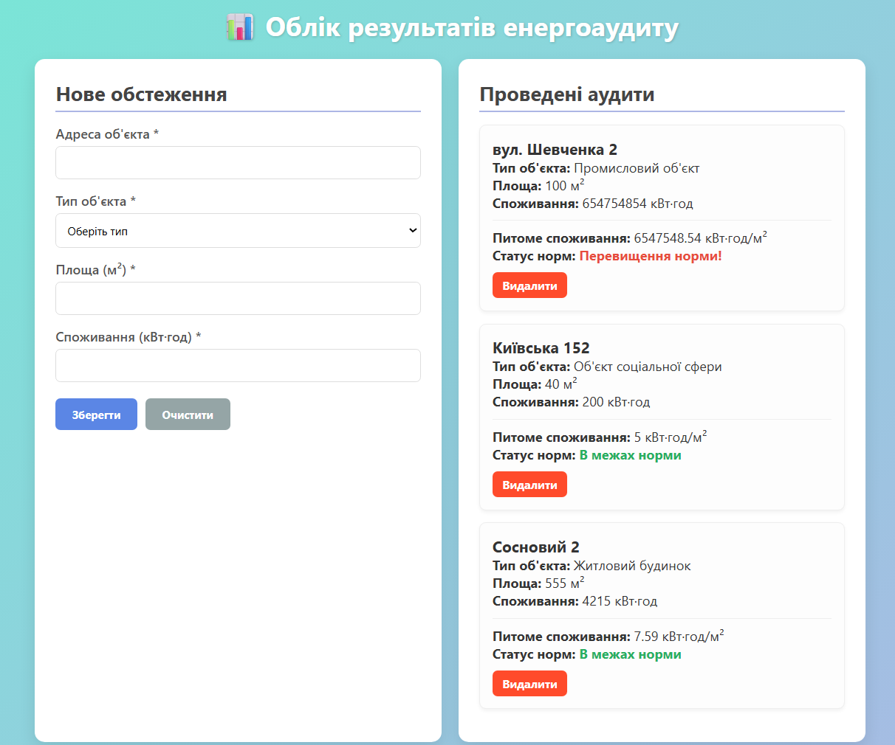

# Практична робота №3: HTML-форми та серверна обробка

## Опис проєкту
Веб-додаток для збору, обліку та аналізу результатів енергоаудиту будівель. Додаток побудовано за клієнт-серверною архітектурою (Full-Stack). Система дозволяє фіксувати показники споживання електроенергії об'єктами різного призначення, автоматично розраховує питоме споживання та перевіряє його на відповідність нормативам.

## Стек технологій
* **Frontend:** HTML5, CSS3 (Flexbox/Grid), Vanilla JavaScript (Fetch API)
* **Backend:** Node.js, Express.js
* **База даних:** MongoDB (через ODM Mongoose)
* **Розгортання БД:** Docker & Docker Compose

## Реалізований функціонал
1. **Збір даних:** HTML-форма з валідацією полів (тип об'єкта, площа, споживання).
2. **REST API:**
   * `POST /api/audits` — створення нового запису обстеження.
   * `GET /api/audits` — отримання історії всіх аудитів.
   * `DELETE /api/audits/:id` — видалення обраного запису.
3. **Бізнес-логіка на сервері:** Автоматичний розрахунок питомого споживання (кВт·год/м²) та визначення факту перевищення норм для різних типів будівель (житлові, комерційні, промислові, соціальні).
4. **Асинхронність:** Динамічне оновлення інтерфейсу без перезавантаження сторінки.

## Інструкція із запуску

### 1. Попередні вимоги
* Встановлений [Node.js](https://nodejs.org/) (версія 16+).
* Встановлений [Docker Desktop](https://www.docker.com/) (для запуску локальної бази даних MongoDB).

### 2. Запуск бази даних
Відкрийте термінал у корені проєкту та запустіть контейнер з MongoDB:
```bash
docker-compose up -d
```

### 3. Запуск сервера

Встановіть залежності проєкту:
```bash
npm install
```

Запустіть сервер у режимі розробки:
```bash
npm start
```

### 4. Доступ до додатка
Після успішного запуску сервера, відкрийте браузер за адресою:

👉 http://localhost:3000

Скріншоти роботи


