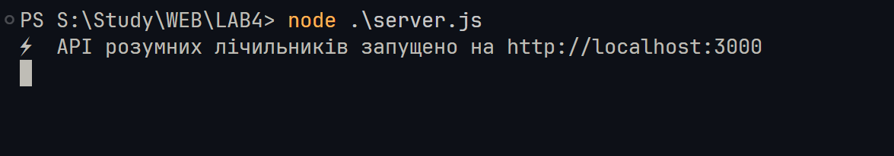
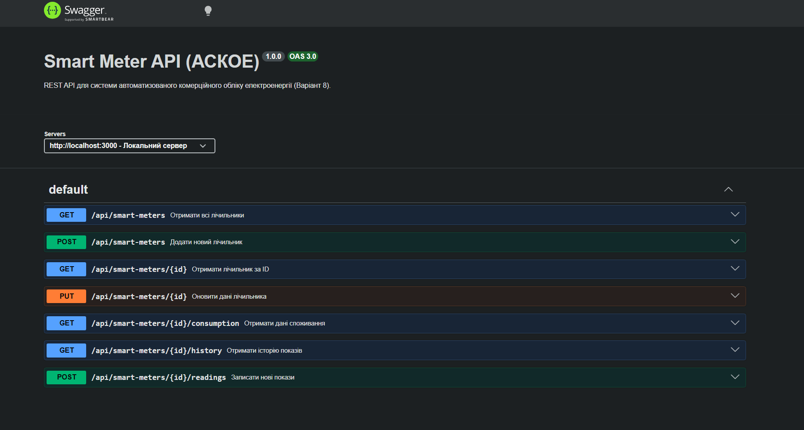
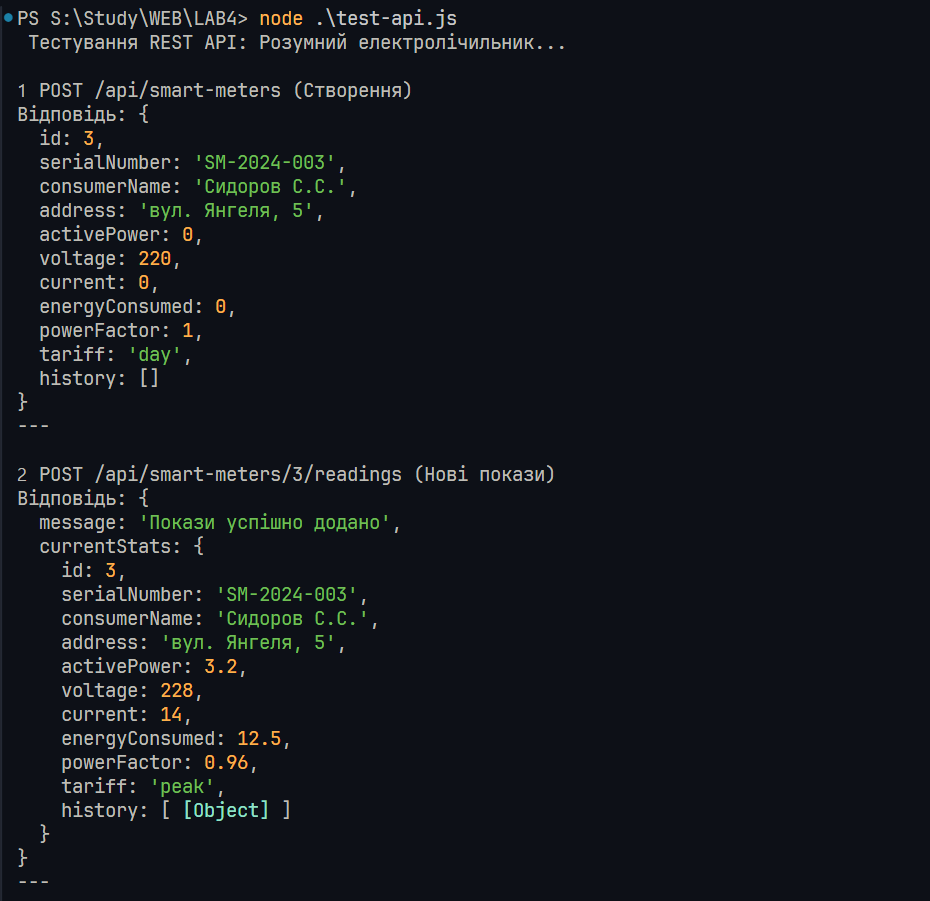
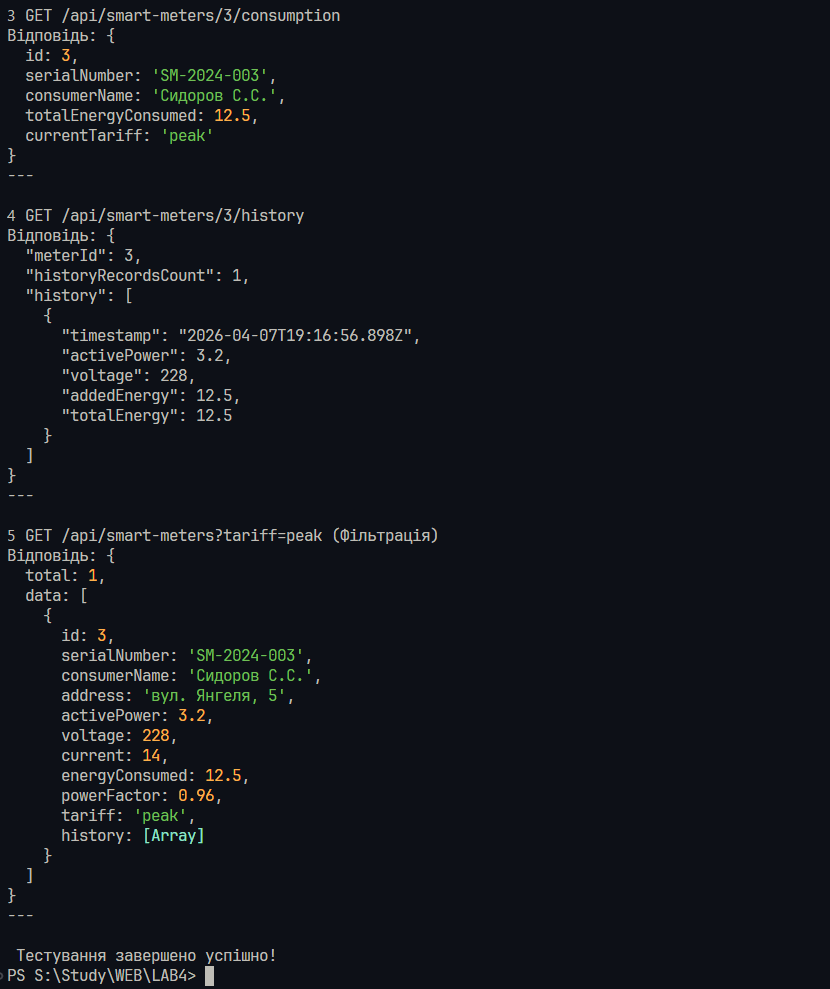

# Smart Meter REST API (АСКОЕ)

REST API для системи автоматизованого комерційного обліку електроенергії "Розумний електролічильник".
Проєкт дозволяє здійснювати моніторинг, віддалене зняття показів та управління даними споживачів.

Розроблено в рамках виконання практичної роботи №4 (спеціальність 121, напрям ІПЗЕ).

---

## Технології

* **Node.js** — серверне середовище
* **Express.js** — веб-фреймворк для маршрутизації
* **Swagger UI** — інтерактивна документація API

---

## Встановлення та запуск

1. Клонуйте репозиторій (або завантажте файли проєкту):

```bash
git clone https://github.com/CeH99/smart-meter-api.git
```

2. Перейдіть у папку проєкту:

```bash
cd smart-meter-api
```

3. Встановіть необхідні залежності:

```bash
npm install
```

4. Запустіть сервер:

```bash
node server.js
```

Сервер буде запущено за адресою:
👉 http://localhost:3000

---

## 📸 Демонстрація роботи програми


---

## Інтерактивна документація Swagger

У проєкті реалізовано інтерактивну документацію за допомогою Swagger.
Після запуску сервера вона доступна за адресою:

👉 http://localhost:3000/api-docs

Тут можна переглянути всі доступні endpoints та протестувати їх роботу без використання сторонніх програм (Postman тощо).



---

## Тестування API 






---

## 📋 Основні Endpoints

| HTTP Метод | Endpoint                          | Опис                                                    |
| ---------- | --------------------------------- | ------------------------------------------------------- |
| GET        | /api/smart-meters                 | Отримати всі лічильники (підтримує пошук та фільтрацію) |
| POST       | /api/smart-meters                 | Створити новий лічильник                                |
| GET        | /api/smart-meters/:id             | Отримати дані конкретного лічильника                    |
| PUT        | /api/smart-meters/:id             | Оновити дані лічильника (ім'я, адреса)                  |
| GET        | /api/smart-meters/:id/consumption | Отримати агреговані дані споживання                     |
| GET        | /api/smart-meters/:id/history     | Переглянути історію показів                             |
| POST       | /api/smart-meters/:id/readings    | Записати нові телеметричні покази                       |

---

## 💡 Додатковий функціонал

* **Фільтрація:** Отримання списку лічильників за тарифом (`?tariff=day`)
* **Пошук:** Текстовий пошук за ПІБ або адресою споживача (`?search=Іванов`)
* **Сортування:** Вивід списку лічильників за обсягом спожитої енергії (`?sortBy=energy`)
* **Валідація:** Перевірка обов'язкових полів при створенні та оновленні даних (повертає код `400 Bad Request`)
