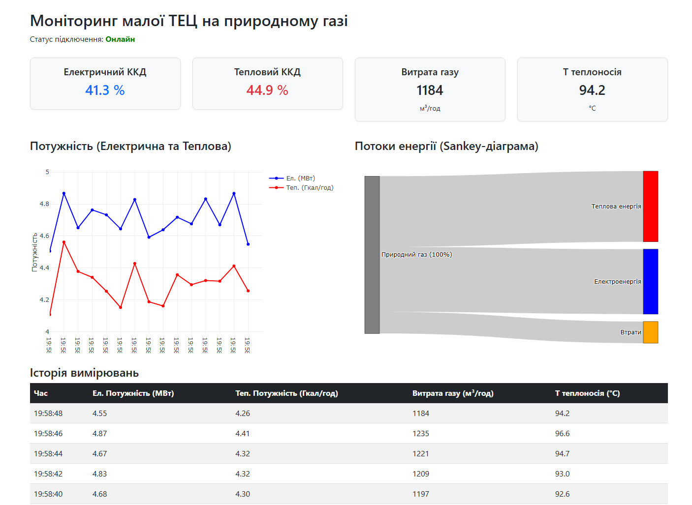

# Моніторинг малої ТЕЦ на природному газі

Клієнтський веб-застосунок для моніторингу параметрів когенераційної установки (ТЕЦ) у реальному часі. Проєкт виконано в рамках Практичної роботи №5 з дисципліни «Основи Веб-програмування».

## Приклад роботи

## Особливості
* **Real-time моніторинг:** Отримання телеметрії (електрична/теплова потужність, витрати газу, ККД, температура) через WebSocket кожні 2 секунди.
* **Інтерактивна візуалізація:**
  * Sankey-діаграма для відображення потоків розподілу енергії від газу до електрики та тепла.
  * Динамічні лінійні графіки потужності.
* **Оптимізація:** Автоматичне очищення історії вимірювань (графіки тримають 15 точок, таблиця — 10 записів) для запобігання перевантаженню пам'яті браузера.
* **Адаптивний дизайн:** Інтерфейс побудовано на базі сітки Bootstrap 5.

## Стек технологій
* **Frontend:** HTML5, CSS3, JavaScript (ES6+), Bootstrap 5, Plotly.js
* **Backend (Test Server):** Node.js, `ws` (WebSocket)

## Структура проєкту
* `index.html` — головна сторінка застосунку.
* `styles.css` — стилі інтерфейсу.
* `app.js` — головний клас застосунку та зв'язування логіки.
* `Api.js` — модуль для роботи з WebSocket.
* `Chart.js` — модуль візуалізації даних (Plotly.js).
* `server.js` — тестовий локальний сервер для генерації даних.
