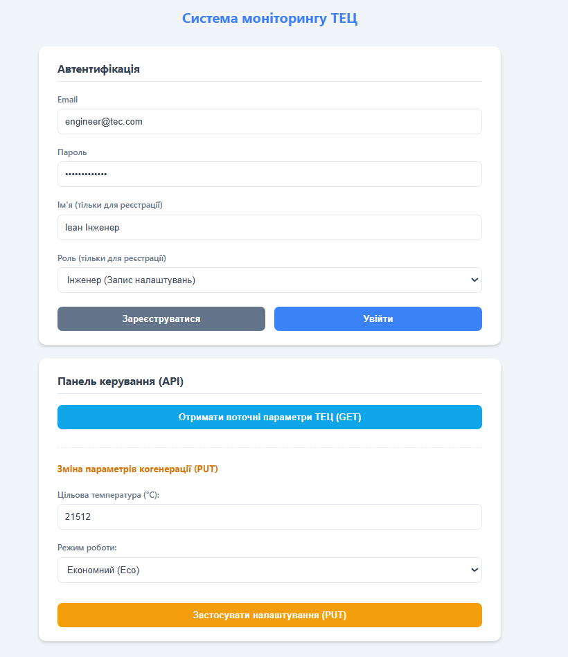
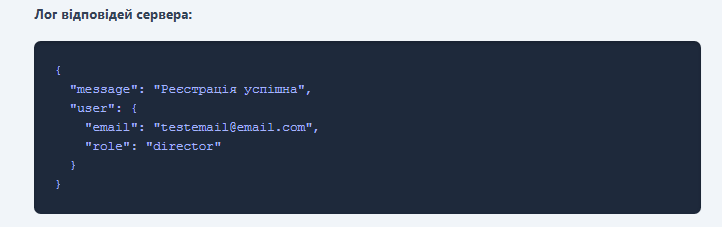
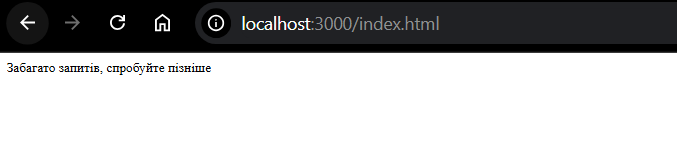
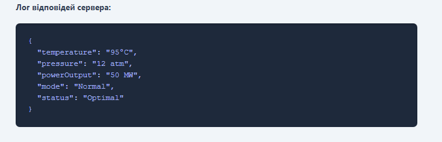
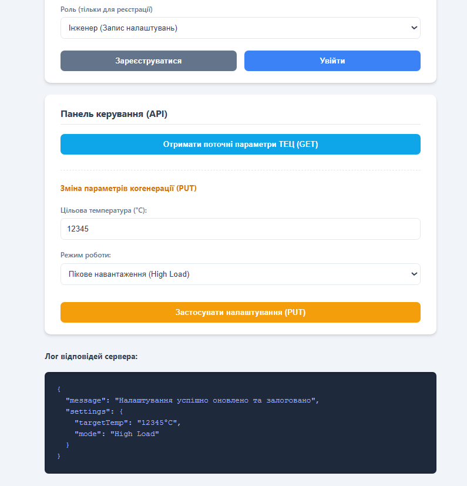

# 🏭 Практична робота №6: Безпека веб-додатків
### Варіант 8 — Система моніторингу когенерації (ТЕЦ)

---

## 📌 Опис проекту

Захищений веб-застосунок для моніторингу та керування параметрами когенераційної установки (ТЕЦ). Головна мета — реалізація надійного API із застосуванням сучасних методів автентифікації, авторизації та захисту від поширених веб-вразливостей згідно з **OWASP**.

Проект розгорнутий у контейнерах **Docker** для ізольованого та швидкого запуску сервера й бази даних.

---

## 🛠 Технологічний стек

| Категорія | Технології |
|---|---|
| **Backend** | Node.js, Express.js |
| **База даних** | MongoDB (Mongoose) |
| **Автентифікація** | Passport.js (Local Strategy), express-session |
| **Безпека** | bcrypt, Helmet.js, express-rate-limit, express-validator |
| **Інфраструктура** | Docker, Docker Compose |
| **Frontend** | HTML5, CSS3, Vanilla JS (Fetch API) |

---

## 🛡️ Реалізовані механізми безпеки

1. **Автентифікація** — безпечний логін та зберігання сесій у `httpOnly` cookies.
2. **Авторизація (RBAC)** — розподіл прав доступу на основі ролей: `operator`, `engineer`, `director`.
3. **Хешування паролів** — алгоритм `bcrypt`.
4. **Захист від XSS** — валідація та санітизація вхідних даних (`express-validator.escape()`), налаштування CSP через `Helmet.js`.
5. **Rate Limiting** — захист від Brute-force атак (ліміт запитів з одного IP).

### ⭐ Специфіка Варіанту 8

| Механізм | Опис |
|---|---|
| **Account Lockout** | Тимчасове блокування акаунту після 5 невдалих спроб входу |
| **Password Expiration** | Перевірка «свіжості» пароля (термін дії — 90 днів) |
| **Audit Trail** | Логування критичних змін налаштувань ТЕЦ у БД (`AuditLog`) |

---

## 🔗 API Endpoints

| Метод | URL | Доступ | Опис |
|---|---|---|---|
| `POST` | `/auth/register` | Всі | Реєстрація нового користувача |
| `POST` | `/auth/login` | Всі | Вхід у систему |
| `POST` | `/auth/change-password` | Auth | Зміна пароля користувача |
| `GET` | `/api/cogeneration/parameters` | Auth | Отримання поточних параметрів ТЕЦ |
| `PUT` | `/api/cogeneration/settings` | Engineer, Director | Зміна налаштувань ТЕЦ (логується в AuditLog) |
| `GET` | `/api/reports/financial` | Director | Отримання фінансового звіту |

---

## 🚀 Запуск проекту

> Переконайтесь, що встановлений [Docker](https://www.docker.com/) та Docker Compose.

**1. Клонуйте репозиторій або перейдіть у папку з проектом.**

**2. Запустіть контейнери:**
```bash
docker-compose up --build -d
```

**3. Відкрийте браузер за адресою:**
```
http://localhost:3000
```

**Зупинка серверів:**
```bash
docker-compose down
```

---

## 📸 Демонстрація роботи

### 1. Головна сторінка — Форма автентифікації
> Інтерфейс для входу та реєстрації користувачів.



---

### 2. Успішна реєстрація та логін
> Реєстрація нового інженера та отримання сесії.



---

### 3. Захист від Brute-force (Rate Limiting та Account Lockout)
> Реакція системи на багаторазове введення неправильного пароля.



---

### 4. Панель керування ТЕЦ — GET запит
> Отримання поточних параметрів системи (доступно для автентифікованих користувачів).



---

### 5. Зміна налаштувань та логування — PUT запит
> Зміна температури та режиму роботи (доступно лише для ролей `Engineer` та `Director`).  
> Демонстрація **Role-Based Access Control**.


